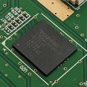

# mdinfo

Quick and simple tool to display info about IOSU's memory devices.  
Can be used to figure out what eMMC chip is built into a console.  

**Note: You need the [MochaPayload](https://github.com/wiiu-env/MochaPayload) for this to work**

## Currently displays:
* Manufacturer ID  
  -> Shows known name and type for that ID
* Product Revision
* Product Name
* CID and CSD
