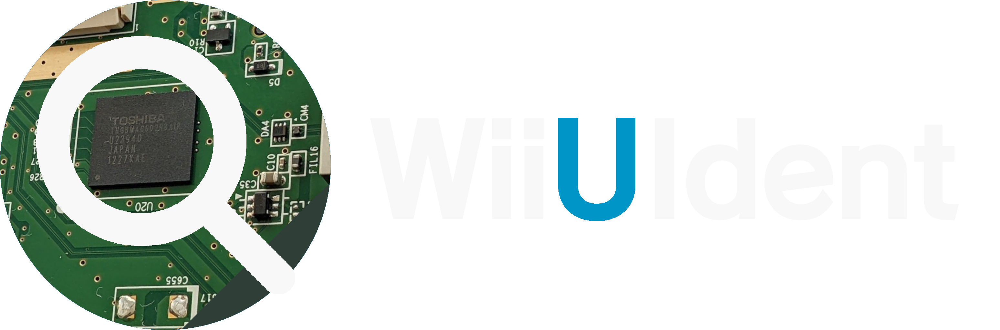
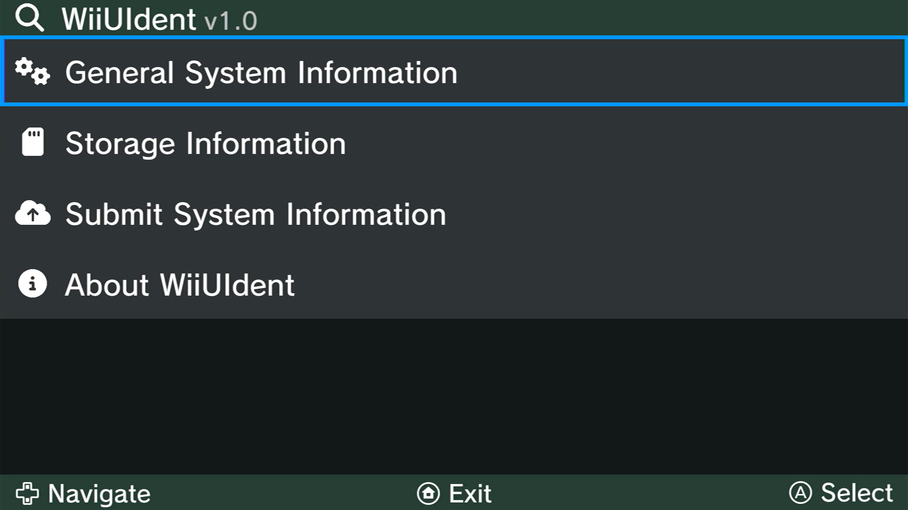
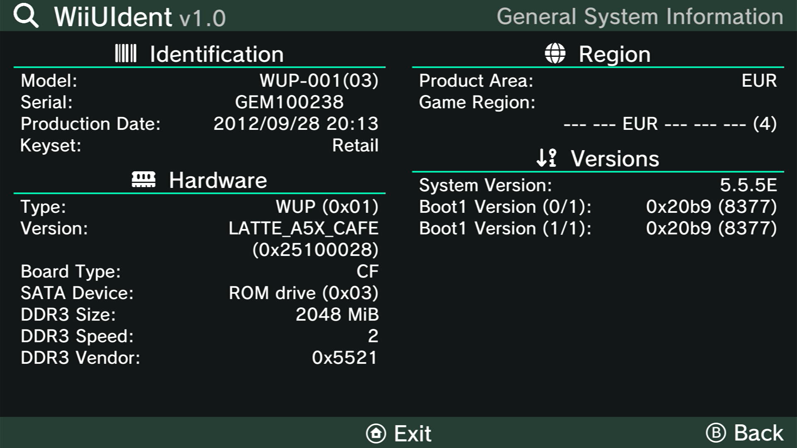
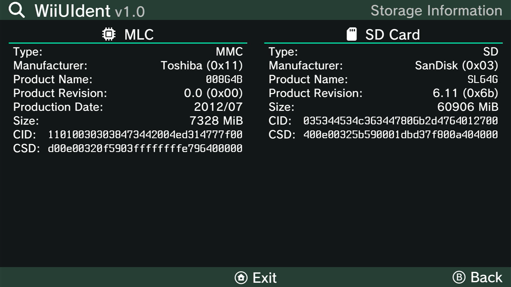
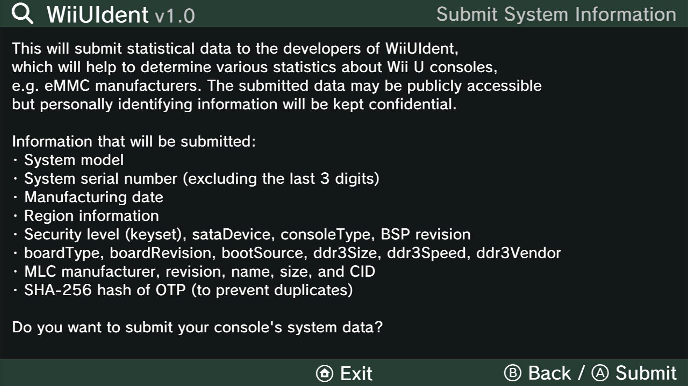
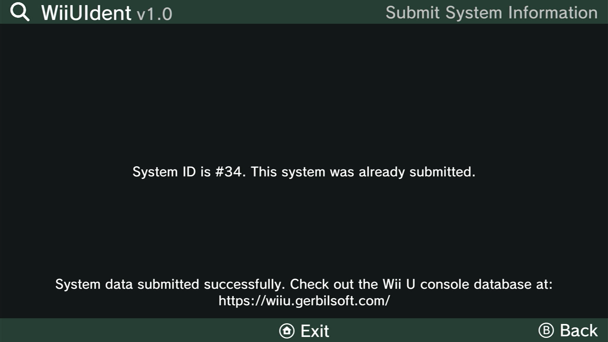
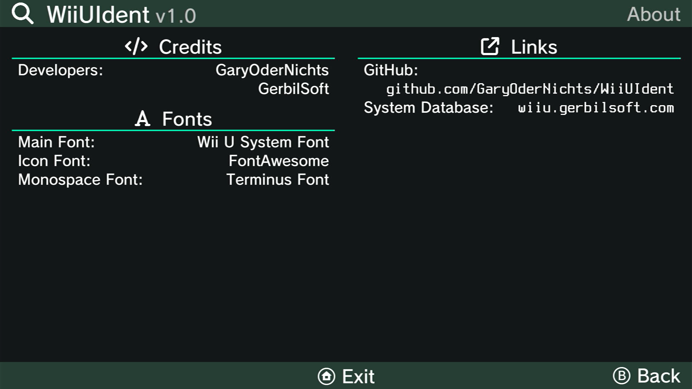

A Wii U Identification homebrew, which display information about console hardware components, software/hardware versions and much more.

> :information_source: **WiiUIdent requires the [MochaPayload](https://github.com/wiiu-env/MochaPayload)!**  
> Make sure to update to [Aroma](https://aroma.foryour.cafe) or [Tiramisu](https://tiramisu.foryour.cafe), in order to use this application.

## Features
WiiUIdent currently displays:

- Identification
    - Model
    - Serial
    - Production Data
    - Keyset
- Hardware
    - Type
    - Version
    - Board Type
    - SATA Device
    - DDR3 Size/Speed/Vendor
- Region
    - Product Area
    - Game Region
- Versions
    - System Version
    - Boot1 Version
- MLC/SD Card information
    - Type
    - Manufacturer
    - Product Name
    - Product Revision
    - Production Date (MLC only)
    - Size
    - CID/CSD

## System Database
WiiUIdent comes with an option to optionally upload system information to a database. This allows collecting various statistics about Wii U consoles.  
After submitting your data, your system information will be added to the database with a System ID, which will be displayed on the console.
The database is publicly accessible but personally identifying information will be kept confidential.  
[The database can be found here!](https://wiiu.gerbilsoft.com/)

## Screenshots







## Building
For building you need: 
- [wut](https://github.com/devkitPro/wut)
- [libmocha](https://github.com/wiiu-env/libmocha)
- [wiiu-sdl2](https://github.com/GaryOderNichts/SDL/tree/wiiu-sdl2-2.26)
- wiiu-sdl2_ttf
- wiiu-curl
- wiiu-mbedtls

You can also build WiiUIdent using docker:
```bash
# Build docker image (only needed once)
docker build . -t wiiuident_builder

# make 
docker run -it --rm -v ${PWD}:/project wiiuident_builder make

# make clean
docker run -it --rm -v ${PWD}:/project wiiuident_builder make clean
```
A pre-built container is available as `garyodernichts/wiiuident_builder`.

## Additional Credits
- [@GerbilSoft](https://github.com/GerbilSoft) for providing the System Database and the "System Information" implementation in the `recovery_menu`.
- [FontAwesome](https://fontawesome.com/) for the icons.
- [Terminus Font](https://terminus-font.sourceforge.net/) for the monospace font.
